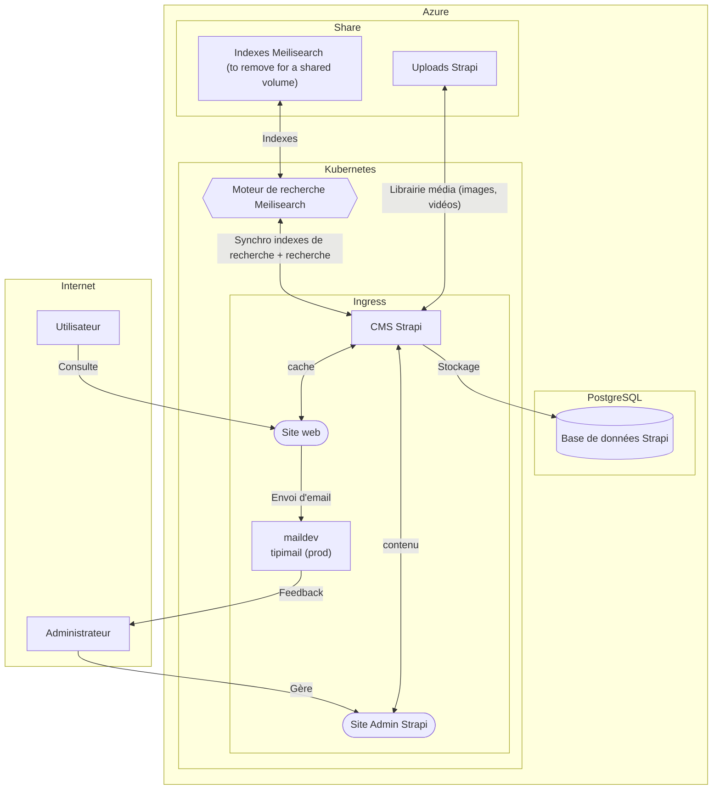

# Maison Numérique de l'autisme

Ce projet a pour but d'aider les personnes concernées par l'autisme à trouver leurs réponses et à mener à bien leurs démarches.

Accessible sur https://maisondelautisme.gouv.fr/.

Ce dépôt est un monorepo créé pour faciliter le déploiement sur l'infrastructure de la [Fabrique numérique des ministères sociaux](https://fabrique.social.gouv.fr).

## Brève description

Mda est composé de deux applications :

- Un CMS strapi.
- Un serveur front en nextjs.

Les données sont stockées dans une base de données postgresql. La recherche utilise [meilisearch](https://www.meilisearch.com/).

## Structure et projets

### eslint-confing

La config eslint du monorepo. Ce projet est une dépendance de développement. Il n'est pas déployé.

### strapi

Ce projet utilise [`strapi`](https://strapi.io/) pour fournir une API pour le front et une interface administrateur de gestion de contenu.

Plus d'information dans le [`README.md`](./apps/strapi/README.md) du projet.

### strapi-plugin-mda

Une extension pour l'interface administrateur de strapi. Elle contient le nécessaire pour gérer les parcours de diagnostic. Ce projet est déployé avec strapi.

Plus d'information dans le [`README.md`](./packages/strapi-plugin-mda/README.md) du projet.

### strapi-types

Ce projet est généré par le modèle de données strapi et contient également des types contrat entre le CMS et le frontend.

Plus d'information dans le [`README.md`](./apps/strapi/README.md) de strapi.

### web

Ce projet utilise [`next.js`](https://nextjs.org/) pour servir le site web principal.

Plus d'information dans le [`README.md`](./apps/web/README.md) du projet.

### shema simplifié d'architecture



## Prérequis

Le projet ayant besoin d'une base de donnée locale pour fonctionner, il est requis d'avoir `docker` et `docker-compose` d'installé.

## Node
Le projet est en node version 18 minimum. Un fichier `.nvmrc` est disponible :

```sh
nvm use
```

Vous devez aussi installer `yarn`.

## Installation des dépendances

```sh
yarn
```

## Lancer

Vous pouvez lancer toutes les applications à l'aide du fichier [`docker-compose.yml`](./docker-compose.yml) mais pour développer, il est plus pratique de lancer les applications une à une.

### Lancer les services nécessaires

Pour lancer les services docker, vous pouvez utiliser la commande

```sh
yarn up
```

Cela lancera la db + l'admin db et meilisearch.

### Lancer strapi

Pour builder strapi, il faut d'abord builder le plugin. Plus d'information dans le [README.md](./apps/strapi/README.md#lancer) de strapi.

### Lancer strapi en local

Plus d'information dans le [README.md](./apps/strapi/README.md#lancer) de strapi.

### Lancer le front en local

Plus d'information dans le [README.md](./apps/web/README.md#lancer) du projet.

### URLs
- Strapi => `http://localhost:1337/admin`
- Web => `http://localhost:3000`
- PgAdmin (pour voir la db) => `http://localhost:5050`

### Arrêter les services en local

Les commandes des projets s'arrêtent avec `Ctrl+C`. Pour arrêter les services docker, vous pouvez utiliser

```sh
yarn stop
```

ou

```sh
yarn down
```

Le volume base de données sera conservé. Si vous souhaitez le supprimer, veuillez le faire manuellement avec `docker volume`.

### Tout lancer depuis la racine

Si vous voulez tout lancer en une commande, vous pouvez utiliser

```sh
yarn dev
```

Mais nous vous recommandons de vous assurer que tout fonctionne bien unitairement.

## Valider le code (lint)

Soit lancer la commande à la racine, soit dans le dossier de chaque application :

```sh
yarn lint
```

## Tester

Il n'y pas encore de tests en place.

## Licence

Apache 2.0 - Direction du numérique des ministère sociaux.

Voir [LICENSE](./LICENSE)


