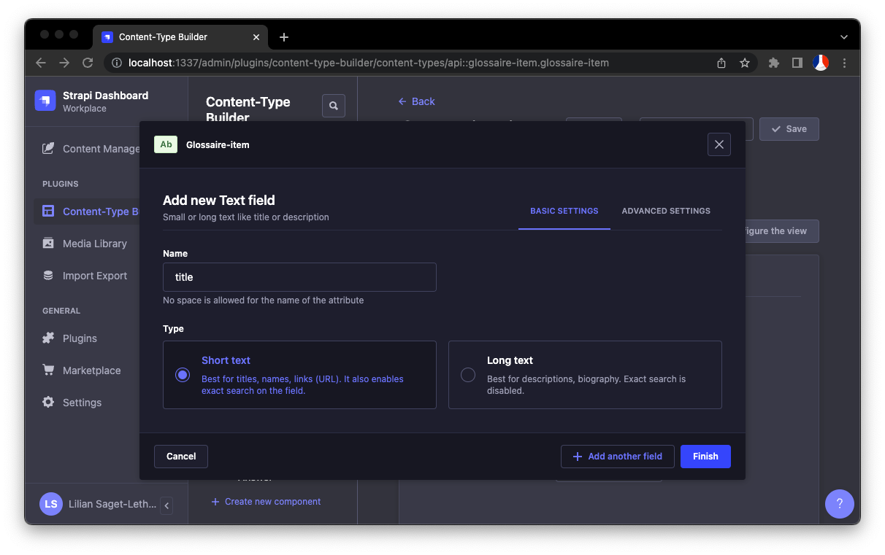

# Ajouter un nouveau content type (Exemples)
Ajouter un nouvel élément dans le projet requiert quelques manipulations dans l'interface d'admin de Strapi, dans le code, et en ligne de commande également.

-- define

## Exemple 1 - Page "Glossaire" - ajout d'un contenu multiple dynamique pour une page unique
### Conception
Avant tout, il est important d'avoir une représentation de la structure de données afin de ne pas s'éloigner vers une conception au fil de l'eau.

La page "Glossaire" originale, est un bon exemple car elle a été intégrée avec des données de test, structurées en amont :
```ts
const tempData = [
  {
    title: "AAH",
    id: "aaH",
    description: "Allocation aux adultes handicapés.",
  },
  {
    title: "AEEH",
    id: "aesh",
    description: "Allocation d'éducation de l’enfant handicapé.",
  },
  {
    title: "AESH",
    id: "aesh",
    description:
      "Accompagnants des élèves en situation de Handicap (autrefois appelé AVS, auxiliaire de vie scolaire).",
  },
  {
    title: "AGED",
    id: "aged",
    description: "Allocation de garde d'enfant à domicile.",
  },
  {
    title: "AGEFIPH",
    id: "agefiph",
    description: "Association de Gestion du Fonds pour l’Insertion Professionnelle des Personnes Handicapées.",
    url: "https://www.agefiph.fr/ ",
  },
];
```
On retrouve donc dans notre modèle les propriétés suivantes :
- un titre `title` de type `string`
- un id `id` de type `string` (qui pourrait finalement être retiré au profit de l'id généré par Strapi)
- une description `description` de type string
- une URL `url` facultative de type `string`

### Strapi
- Aller dans le "Content-Type Builder` et cliquer sur "+ Create new collection type" sous la liste "Collection Types"
- Ajouter le "Display name". Les "API ID" se rempliront automatiquement ; même si il sont modifiables, il est conseillé de laisser la valeur générée par défaut.

- Aller dans l'onglet "Advanced Settings" puis décocher "Draft & publish". Le projet ne gérant pas le mode preview, chaque modification doit être publiée directement.

- Cliquer sur "Continuer" puis sélectionner au fur et à mesure les champs correspondant à l'item en construction.

- Dans l'onglet "Advanced Settings", il possible de définir des contraintes de validation qui seront appliquées à la création ou à l'édition d'un contenu du type en cours de création

- Cliquer sur le boutton "+ Add another field" pour continuer l'ajout de champs, ou "Finish" pour terminer la création du content-type
- Cliquer enfin sur le bouton "✔ Save". Strapi va restart et créer les fichiers correspondants dans le projet


Maintenant que l'élément est créé il faut configurer son accès API public (pour pouvoir récupérer les données depuis l'app web), et ajouter des données de seed par défaut pour l'environnement de review.

- Aller dans "Settings" puis "Users & Permissions Plugin > Roles"
- Cliquer sur le rôle "Public"
- Ajouter les rôles "find" et "findOne" pour le content-type nouvellement créé

- Cliquer sur le bouton "✔ Save"
- Synchroniser les fichiers locaux de config (cf [doc strapi "Synchroniser manuellement les configs"](./strapi.md#synchroniser-manuellement-les-configs))

- Enfin, créer de la donnée puis l'exporter (cf [doc strapi "Exporter des données"](./strapi.md#exporter-des-données))
- Par rapport à l'exemple, le fichier sera le cas présent nommé `glossaire-item.json` et placé dans le dossier `apps/strapi/src/utils/seed/`
- Ajouter la référence au seed dans le fichier `src/bootstrap/dev/seed-db.ts` dans la const `seed`

Maintenant que la structure de données est prête, il faut regen les types TypeScript pour faciliter l'autocomplete du projet :
```sh
# dans le dossier de strapi
yarn generate-types
```

Le fichier sera alors généré dans le package [`@mda/strapi-types`](../packages/strapi-types/index.d.ts).

Dans le cas présent, le content-type n'est pas destiné à des pages dynamique avec "slug" (comme "Fiches Pratiques"), la configuration du webhook de revalidation n'est donc pas nécessaire.

### Web
- Transformer la page en async component et utiliser la fonction `fetchStrapi` pour récupérer les données
- L'autocomplete et le typing permettent de simplifier grandement le code

- Gérer la présence ou non de données après fetch. Si `items.data` est `null` ou un tableau vide, c'est qu'il n'y a pas de données en base. Il faut s'assurer que la page fonctionne quand même dans le cas présent. Une redirection avec la méthode `notFound` de `next/navigation` est une solution.
- Les données récupérées du tableau sont ensuites accessibles sous la propriété `attributes`


## Exemple 2 - Page "Fiche Pratique" - ajout d'un contenu multiple dynamique pour un ensemble de page
TODO

## Exemple 3 - Page "La Maison de l'autisme" - ajout d'un contenu unique pour une page unique
TODO
