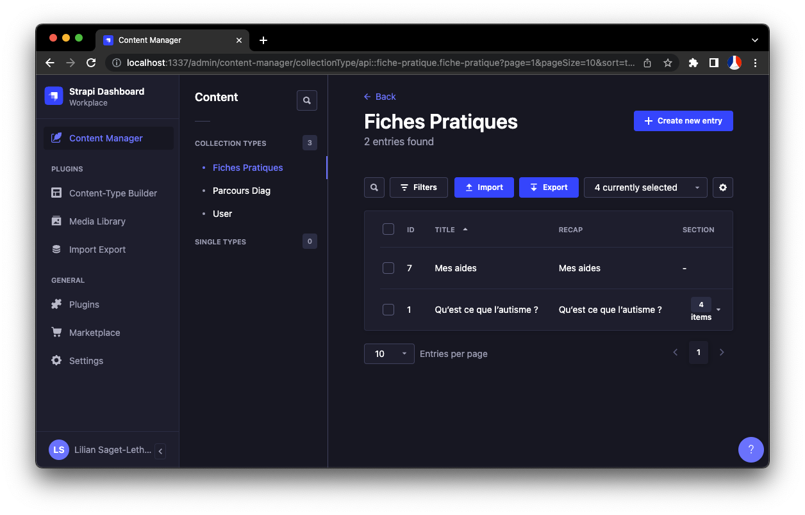
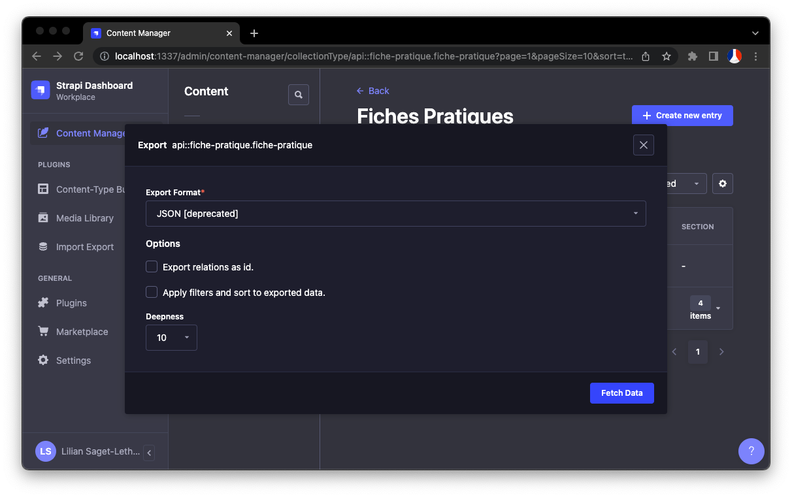
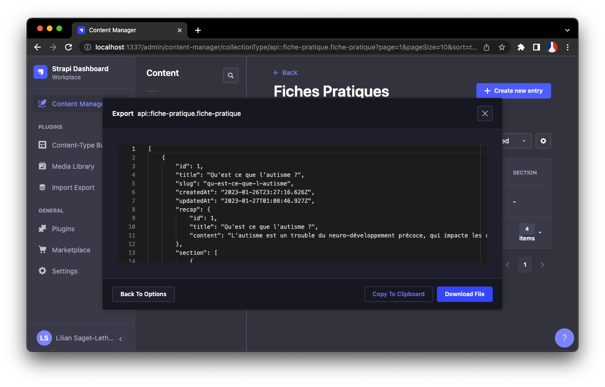
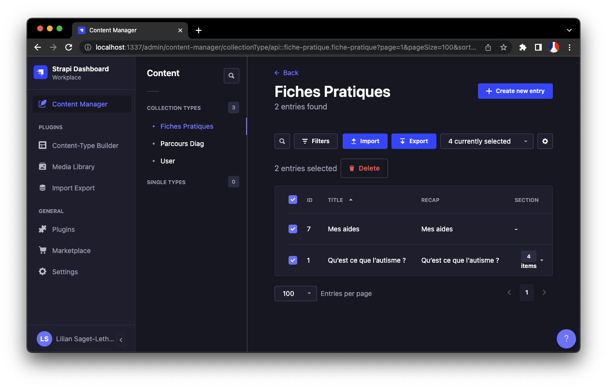
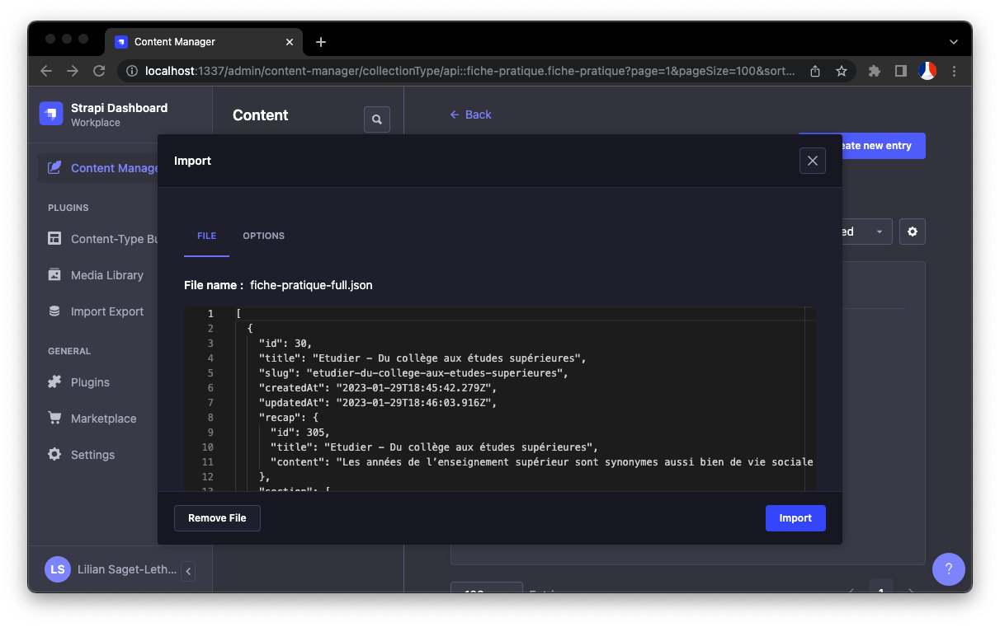
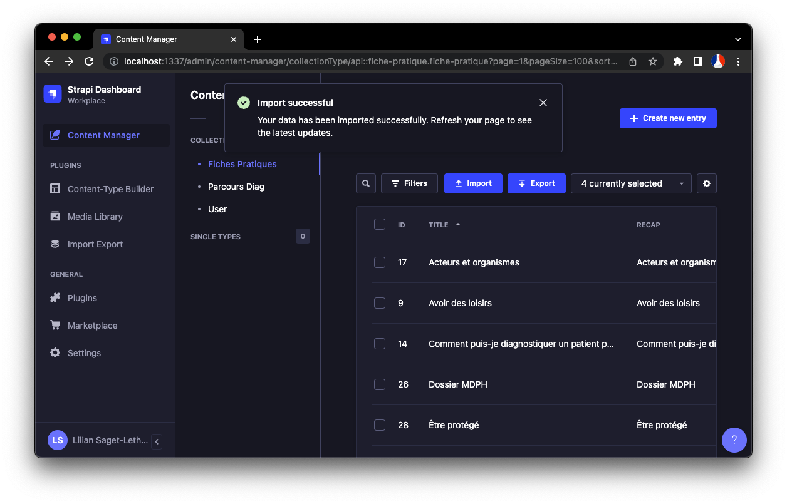
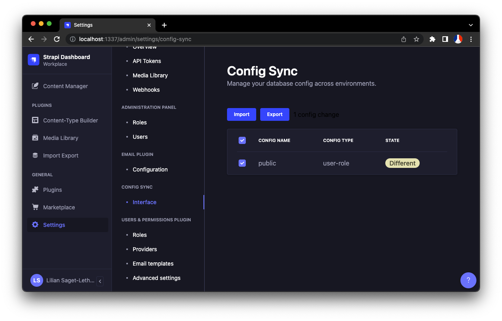
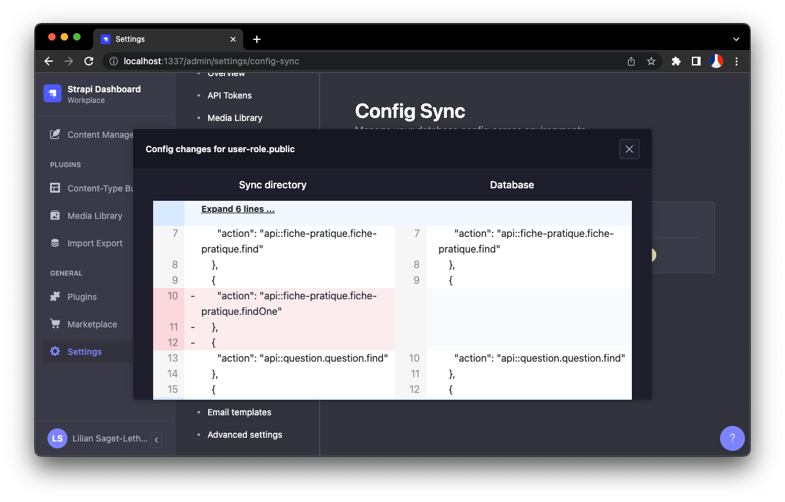

# Utilisation de Strapi

Dossier : `apps/strapi/`

## Organisation des dossiers

cf. https://docs.strapi.io/developer-docs/latest/setup-deployment-guides/file-structure.html

## Variables d'environnement & Config
En dev, les variables d'environnement de Strapi sont chargées via le fichier `.env`.  
Il faut donc toujours s'assurer que ce fichier soit complet. Un exemple de contenu est trouvable dans le fichier `.env.example`.

L'exemple, donne des valeurs `tobemodified` pour chaque secret qui aurait besoin d'une valeur cryptée. Il est possible de regénérer une base de fichier en utilisant (sous OSX) la commande `yarn generate-env` directement dans le dossier `strapi`. (ne pas oublier de compléter le fichier généré ensuite).

## Typescript
Par défaut, Strapi (en date du 07/02/2023, version 4.6.0) supporte une version inférieure à notre version de Typescript du monorepo. Une version plus récente est donc forcée afin de garantir l'utilisation d'une seule version à travers l'ensemble du projet, app web incluse.

Strapi en lui même est très peu ou mal typé, le projet contient donc un ensemble de types custom reprenant les configurations essentielles évoquées par la documentation officielle, ce afin d'apporter un minimum d'autocomplete lors de la modifications des `lifecycles` ou des configs.

## Ajouter un nouveau content type
cf. [la page dédiée](./new-content-type.md)

## Seed et import/export de données
Plusieurs environnement sont disponibles pour le projet : local, review, preprod, et prod. "local" et "review" sont considéré comme des environnement de `dev`, ils auront donc la variable d'environnement `MDA_ENV=dev` (`preprod` pour la preprod, et `prod` pour la prod). Grâce à cette distinction, des methodes de `lifecycles` sont exécutées en fonction de l'environnement.  
En `dev` (donc "local" et "review"), des données seront automatiquemnt préchargée dans Strapi **seulement si** aucune donnée n'éxiste au préalable. D'un côté, un compte super admin sera créé (si non présent) avec l'email `admin@strapi.dev` et le mot de passe `admin`. De l'autre côté, des jeux de données seront chargés pour les différents seeds configurés dans le fichier `src/bootstrap/dev/seed-db.ts`.  
Les données de seed sont présentes dans le dossier `src/utils/seed/`. Les fichiers de seed en `*-full.json` sont des données plus ou moins fraîches issues de la prod. Ceux en `*.v2.json` et `*-full.v2.json` sont pour l'instant non fonctionnels. Enfin, donc, ceux en `*.json` "normaux" sont ceux injectés par défaut.

Ces données sont accessibles (et chargées) via le plugin [`import-export-entries`](https://github.com/Baboo7/strapi-plugin-import-export-entries) qui en permet la manipulation manuellement ou programatiquement.

### Exporter des données
- Lancer strapi et aller sur l'admin (http://localhost:1337/admin)
- Dans le "Content Manager", aller sur le "content" à exporter

- Cliquer sur le bouton "Export" et sélectionner le format "**JSON [deprecated]**"

- Cliquer sur "Fetch Data" pour récupérer la donnée

- Sauvegarder ou copier le contenu

Attention lors du remplacement des fichiers de seed d'être sûr des données exportées.

### Importer des données
- Lancer strapi et aller sur l'admin (http://localhost:1337/admin)
- Dans le "Content Manager", aller sur le "content" à importer

- Sélectionner **TOUTES** les données existantes et les supprimer. Cette étape est indispensable et permet d'éviter les conflits potentiels. Les imports sont donc évidemment déconseillés en prod.

- Cliquer sur le bouton "Import" et sélectionner ou déposer le fichier

- Ne changer aucune option et importer les données

## Synchronisation de la configuration
La configuration générale de l'administration de Strapi est synchronisée et persistée sur chaque environnement. En local, cette configuration n'est en revanche pas automatiquement synchronisée, il faut effectuer cette étape manuellement.

Lors du changement de certains paramètre de configuration interne à Strapi (via l'interface d'admin), il est important de toujours s'assurer que les fichiers de config sont toujours synchronisés avec le contenu de la base de données.  
Cette synchronisation est faisable via l'écran du plugin [`config-sync`](https://github.com/boazpoolman/strapi-plugin-config-sync).

### Synchroniser manuellement les configs
- Après changement d'une configuration dans l'interface (principalement les ajout et changement d'accès aux content-types), aller dans "Settings" puis "Config Sync > Interface"

- Lorsqu'une différence est détectée, l'interface le fait remarquer
- Cliquer sur une ligne permet d'afficher le diff. Cette étape peut par exemple aussi permettre de récupérer en prod l'équivalent JSON de la configuration souhaitée

- Cliquer sur "Import" pour mettre à jour la base de données à partir des fichiers locaux
- Ou Cliquer sur "Export" pour mettre à jour des fichiers locaux à partir de la base de données. Cette opération n'a d'intérêt qu'en local et non sur les environnements déployés car les fichiers présents et modifiés ne seront pas accessibles.
